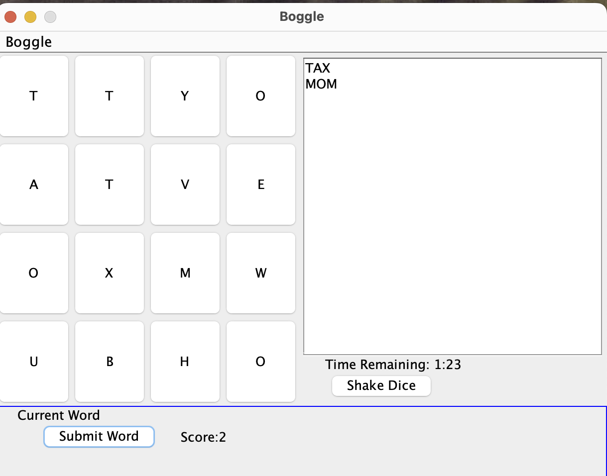

 # Boggle Java Application

This is a Java-based implementation of the classic Boggle game. The application allows users to generate a Boggle board and search for words. It is built with object-oriented principles and modularized into packages for clear separation of concerns.




## Project Structure
```
Boggle/
├── boggle
│   └── Boggle.java       # Main entry point
├── core
│   ├── Board.java        # Board logic
│   ├── Die.java          # Die representation
│   ├── IBoard.java       # Interface for Board
│   └── IDie.java         # Interface for Die
├── inputOutput
│   ├── IReadDataFile.java  # Interface for file reading
│   └── ReadDataFile.java   # File reading logic
├── userInterface
│   └── BoggleUI.java     # User Interface Logic
└── data
    ├── BoggleData.txt    # Data for game
    └── Dictionary.txt    # Word dictionary
```

## Getting Started

### Prerequisites
- Java JDK (8 or above)

### Running the Application
Navigate to the `src` directory:
```bash
cd path_to_your_project/Boggle/src
```

Compile the main entry point:
```bash
javac boggle/Boggle.java
```

Run the application:
```bash
java boggle.Boggle
```

You should now see the game interface or command prompts.

### Troubleshooting
If you encounter issues:
- Ensure you're in the correct directory (`src`).
- Use the correct package names (`boggle.Boggle`).

### License
This project is licensed under the MIT License - see the LICENSE file for details.

### Author
Jamal Bryan
